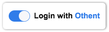

# Othent.io React Components Library



The Othent React Components Library is a collection of React components designed
to provide a seamless way for developers to integrate Othent into their React
applications.

## Installation

To use the components in your React project, you can install it using `npm`:

```
npm i @othent/react-components
```

Using `yarn`:

```
yarn add @othent/react-components
```

Or using `pnpm`:

```
pnpm add @othent/react-components
```

## Usage

To use the components, you can import them directly into your project:

```
import { OthentLogin } from '@othent/react-components';
```

And then add them inside your React application:

```
<OthentLogin />
```

> 💡 Despite the library is modular and you can use each component as you wish,
> the main component, `OthentLogin`, is probably all you need if don't need to
> customize the behaviour of the login flow.

## Documentation

For more information on how to use the Othent React Components Library, please
see the official Othent documentation at
[https://docs.othent.io/developers/component-library](https://docs.othent.io/developers/component-library).

## Contact

If you have any questions or issues with the Othent Library, please contact us
at [hello@othent.io](mailto:hello@othent.io) or open an issue in the GitHub
repository.

## License

The Othent Library is licensed under the MIT License. Please see the LICENSE
file for more information.
